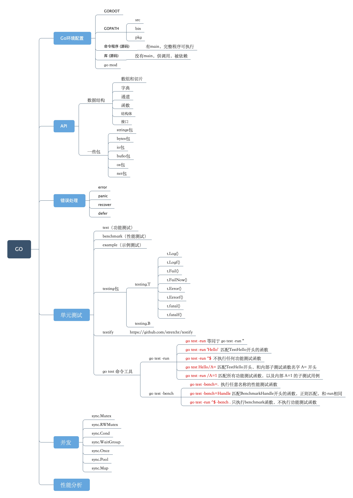

  

 

 

- [`Golang`](./README.md)
  - [`1、环境配置`](./1、环境配置.md)
  - [`2、go语法注意点`](./2、go语法注意点.md)
  - [`3、一些命令`](./3、一些命令.md) 
  - [`4、go一些简单语法、数据类型、流程控制`](./4、go一些简单语法、数据类型、流程控制.md)
  - [`5、go_mod`](./5、go_mod.md)
  - [`6、go_interface`](./6、go_interface.md) 
  - [`7、go中的指针`](./7、go中的指针.md) 
  - [`8、方法`](./8、方法.md)
  - [`9、结构体`](./9、结构体.md) 
  - [`10、函数`](./10、函数.md)
  - [`11、go并发编程`](./11、go并发编程.md)
  - [`12、go程序单元测试`](./12、go程序单元测试.md)

