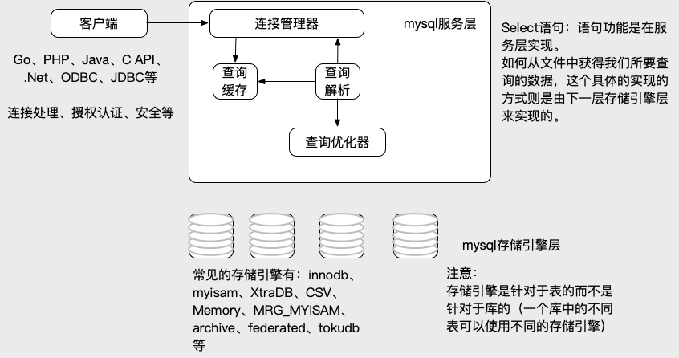

  

- `mysql`
  - [`一、mysql 必知必会`]()
    - [`1.1、mysql 安装配置`](./1.1、mysql安装配置.md)
    - [`1.2、mysql 常用命令`](./1.2、mysql常用命令.md)
    - [`1.3、必会的sql (一)`](./1.3、必会的sql(一).md)
  
  - [`二、mysql 常用工具`]()
    - [`2.1、mysqldump`](./2.1、mysqldump.md)
  
  - [`三、mysql 性能优化`]()
    - [`3.1、影响数据库性能的因素`](./3.1、影响数据库性能的因素.md)
    - [`3.2、CentOS参数配置对mysql性能优化`](./3.2、CentOS参数配置对mysql性能优化.md)
    - [`3.3、mysql 存储引擎对性能影响`](./3.3、mysql存储引擎对性能影响.md)
    - [`3.4、mysql 服务器参数介绍`](./3.4、mysql服务器参数介绍.md)
    - [`3.5、MySQL 基准测试`](./3.5、MySQL基准测试.md)
    
  - [`四、mysql 架构设计`]()
    - [`4.1、数据库结构设计`](./4.1、数据库结构设计.md)

