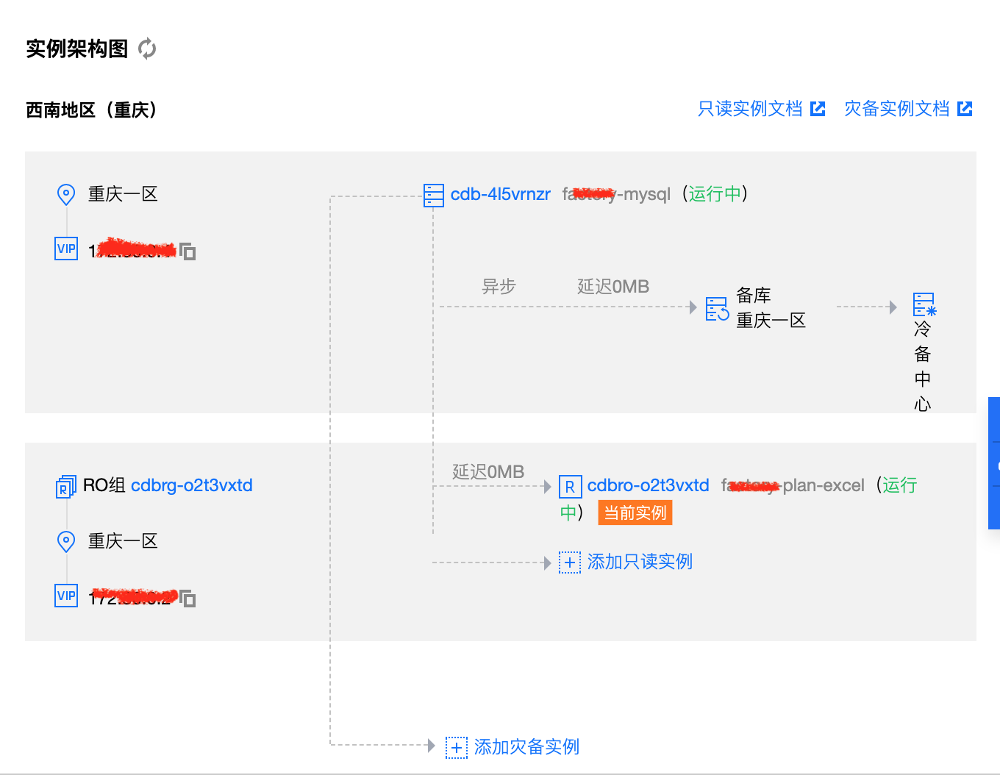
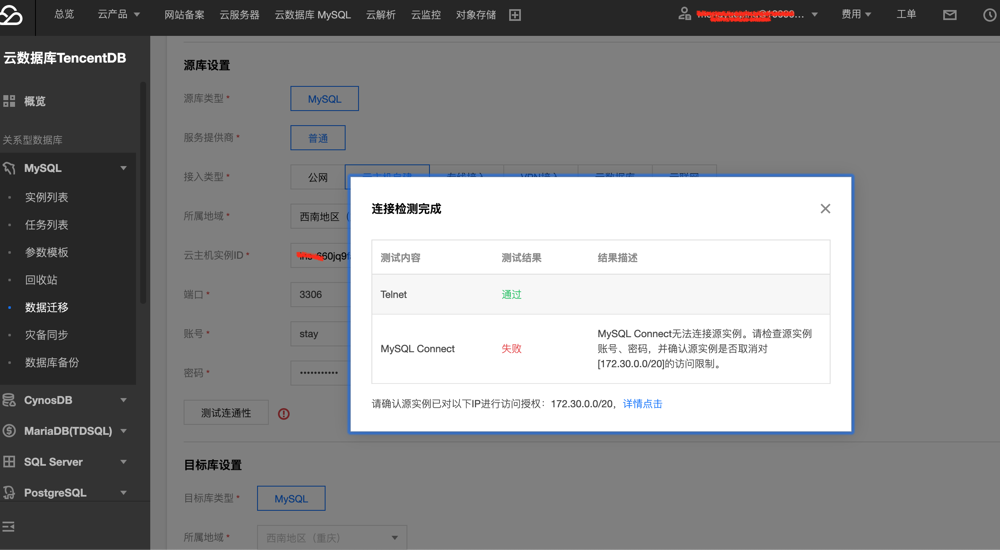
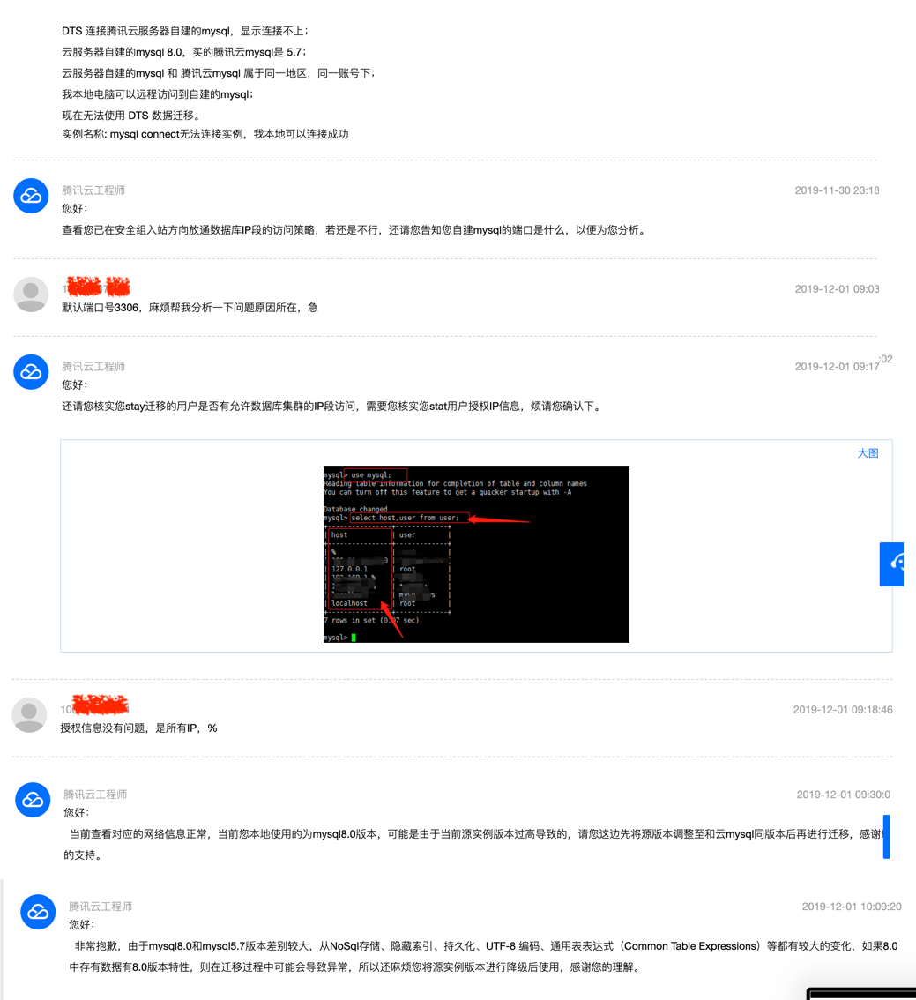

# 记一次 `mysql` 数据库迁移（一）
## 一、准备

- 目标：

腾讯云 `CVM` 自建 `mysql` 数据迁移到腾讯云数据库 `mysql` 。

- 腾讯云 `CVM` 自建 `mysql` 现状：
    - 1、mysql 版本：`Ver 8.0.15 for Linux on x86_64 (MySQL Community Server - GPL)`
    - 2、mysql 文件目录数据大小： 2.4 G  (`/var/lib/mysql`)
        > - 查看 `msyql` 数据目录位置：`mysql> show variables like '%datadir%';`
        > - 查看 `/var/lib/mysql` 目录的大小: `du -sh`
        
        ```
        mysql> show variables like '%datadir%';
        +---------------+-----------------+
        | Variable_name | Value           |
        +---------------+-----------------+
        | datadir       | /var/lib/mysql/ |
        +---------------+-----------------+
        1 row in set (0.04 sec)
        ```

    - 3、只有一个 `root` 账户，只允许 `localhost` 访问
    - 4、数据库字符集：`charset=utf8`

- 起因：
    
    `api` 服务、报表计划任务、以及其他计划任务、自建 `mysql` 都在同一台腾讯 `CVM` 上面。计划任务执行的时候，`mysql` 占用 `CPU` 过高，会导致 `api` 服务无法正常使用。所以考虑腾讯云数据库 `mysql`，使用主从架构（先尝试使用一主一从），`master mysql` 主要服务于 `api` 服务，`slave mysql` 主要用于计划任务。

- 腾讯云数据库 `mysql` ：
    - 1、腾讯云数据库 `mysql` 与腾讯云服务器 `CVM`，同一账号下，同一个地域支持使用内网 `ip` 访问。（比如 `CVM` 是重庆，云数据库必须也是重庆，并且是在同一账号下）
    
    - 2、购买腾讯云 `mysql 5.7`（支持的最大版本，没有`8.0`）：先购买一台高可用版 `mysql`，作为 `master mysql`，之后可以扩展多台 `slave mysql`
    
    - 3、迁移工具：腾讯云`DTS`，`mysqldump`（备用）
    

## 二、迁移

- 1、使用 DTS 迁移

购买完云 `mysql`，初始化，开始使用 `DTS` 进行迁移。 自建 `mysql` 和 云 `mysql` 是属于同一个账号下，同一区域下，可以使用内网直接访问。




- 2、查看 `CVM` 自建 `mysql` 用户

```
mysql> select host,user,plugin from user;
```

发现只有一个 `root` 账号，只能 `localhost` 访问，需要创建新账号，指定购买的云 `mysql` 的内网 `ip` 授权访问的新账号。在 `CVM` 自建 `mysql` 创建账号：

```
mysql> GRANT ALL PRIVILEGES ON *.* TO "stay"@"1xx.xx.0.0" IDENTIFIED BY "111";
```

创建账号，并授权，发现报错。提示不能用 `grant` 创建用户。 原来 `mysql8.0` 以前的版本可以使用 `grant` 在授权的时候隐式的创建用户。`mysql8.0` 以后已经不支持。`mysql8.0` 必须先创建用户，然后再授权，命令如下:

```
mysql> CREATE USER 'stay'@'172.30.0.0' IDENTIFIED BY '密码';
Query OK, 0 rows affected (0.48 sec)

mysql> grant all privileges on *.* TO 'stay'@'172.30.0.0';
Query OK, 0 rows affected (0.48 sec)
```

> 注意：密码不能和 root 账户相同。

> 参考 mysql8.0 文档：https://dev.mysql.com/doc/refman/8.0/en/privileges-provided.html


- 3、在腾讯云 `mysql` 操作 `DTS`

输入源库设置，接入类型选择云主机自建，选择自建 `mysql` 所在的主机实例`ID`，所属区域，自建 `mysql` 的端口号，输入新建的账号，密码。

配置完成之后，测试连通性，`Telnet` 通过，`MySQL Connect` 失败。提示：`MySQL Connect无法连接源实例。请检查实例账号、密码，并确认源实例是否取消对[172.30.0.0/20]的访问限制` 如图：



创建账号的时候，对`[172.30.0.0/20]`的访问是授权的。

尝试设置 `CVM` 服务器安全组，把 `172.30.0.0`（即云`mysql`内网 `ip`）设置为信任访问 `3306` 端口。测试连接依然不行。

尝试新创建了一个对所有`ip`都能访问授权的账号，并测试在本地电脑远程连接自建 `mysql` 是没有问题的。然后把这个账号密码配置到 `DTS` 源库上，测试连通性，依然不行。

给腾讯云 mysql 提了工单，让腾讯云工程师协助解决。工单：



> 源库连接失败原因：
>   - 数据库账号或密码不正确
>   - 源数据库对来源IP进行了限制
>   - 源数据库服务器设置了防火墙
>   - 网络互通问题  
> 可以参考：https://help.aliyun.com/document_detail/52099.html?spm=a2c4g.11186623.2.27.2d2e37admhRAPG


知道是因为版本问题导致的，自建 `mysql` 是 `8.0.15`，而腾讯云 `mysql` 最高支持 `5.7`，`DTS` 不支持从 `8.0.15` 迁移到 `5.7`，所以连通性测试会一直失败。


- 4、使用 `mysqldump` 手动迁移数据

> mysqldump 工作原理：查出需要备份的表结构 -> 生成一个 create sql语句（sql后缀名的文本文件）；表中所有记录 -> 转成一条 insert 语句。

先从源数据库导出数据库表结构信息：
```
# 导出数据库表结构（导出的是创建表结构的sql语句）
mysqldump --opt -d[库名] -u[数据库用户名] -p[密码] > /导出的文件名字存储路径.sql
```

从源数据库导出数据信息：
```
mysqldump -t[数据库名] -u[数据库用户名] -p[数据库密码] > xxx.sql
```

`CVM` 主机上使用内网 `ip` 链接云 `mysql`，先创建同名数据库：

```
mysql> create DATABASE sf_factory charset=utf8;
```

然后，依次导入数据库表结构信息，数据库数据：

```
mysql> source [导出的数据库表结构.sql];
mysql> source [导出的数据库数据.sql];
```

> 参考 msyql 8.0官方文档：https://dev.mysql.com/doc/refman/8.0/en/mysqldump-copying-to-other-server.html


- 5、验证数据完整性

- 6、删除自建 `mysql` 多余账号信息

```
mysql> drop user stay@"172.30.0.0/20";
```

方式一：`drop` 不仅会将 `user` 表中的数据删除，还会删除对应权限表内容。

```
#drop user xxxx; 默认删除的是 'xxxx'@'%'
drop user xxxx;

drop user 'xxxx'@'localhost';
drop user 'xxxx'@'172.xx.x.x';
```

方式二：`delete` 只会删除 `user` 中的内容。所以使用 `delete` 删除用户后需要执行 `FLUSH PRIVILEGES;`刷新权限，否则下次使用 `create` 创建用户会报错。


